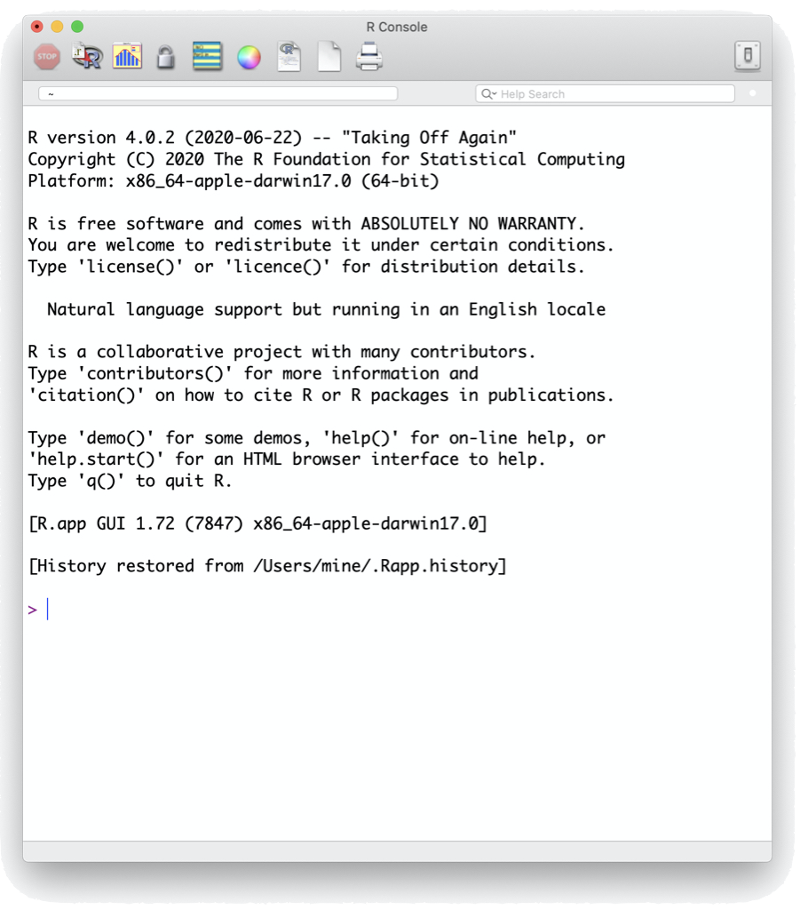
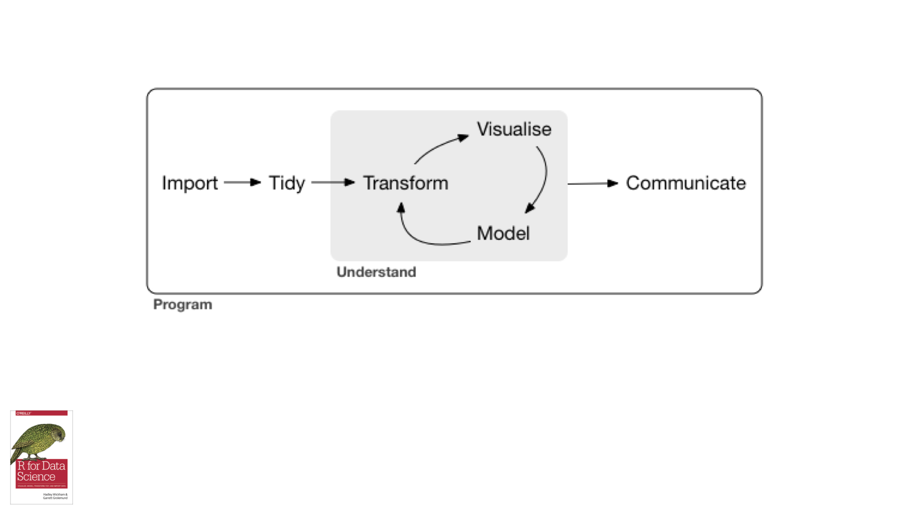
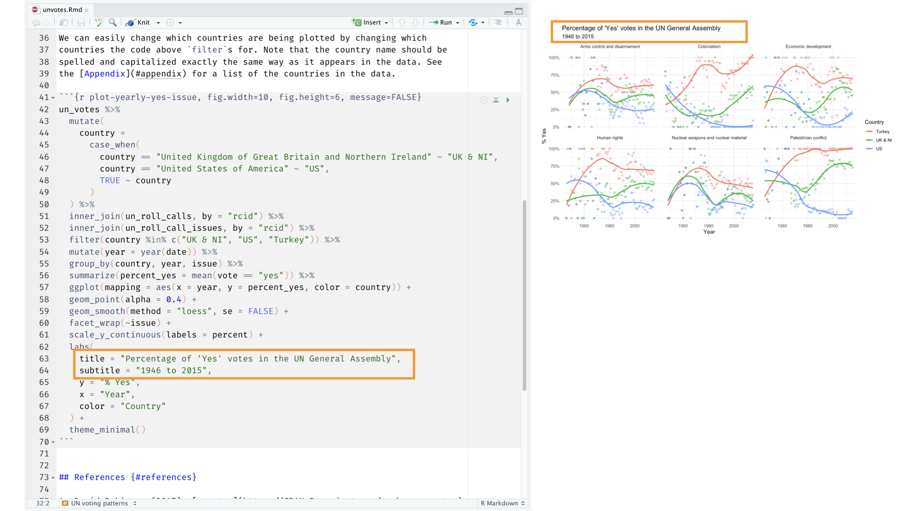
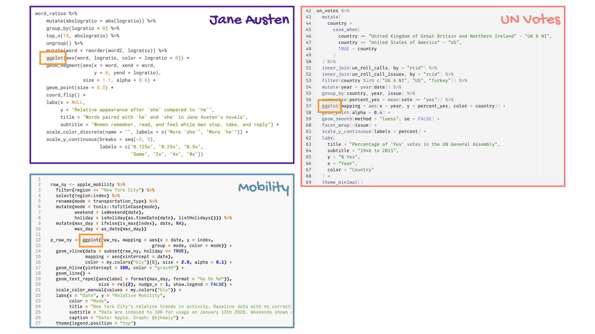

```{r child = "../setup.Rmd"}
```

```{r packages, echo=FALSE, message=FALSE, warning=FALSE}
library(tidyverse)
library(nycflights13)
```

class: middle

# Bem-vindo!


---

## Sobre mim

.pull-left[
```{r echo=FALSE,out.width="50%",fig.align="center"}

```
]
.pull-right[
__Henrique C. Costa__
- Mestre em Economia Aplicada, Universidade Federal de Mato Grosso
- Entusiasta a Ciêntista de Dados
- Analista de Risco, Liberum Ratings

.midi[
`r emo::ji("link")`  [hcostax.com](https://hcostax.com/)  
`r emo::ji("bird")`  [@hcostax](https://twitter.com/hcostax)  
`r emo::ji("radio_button")`  ele/dele  
]
]

---

class: center, middle

## E sobre vocês?

---

## Logística

- Tudo em um só lugar: [bit.ly/bootcamp-nuigalway](http://bit.ly/bootcamp-nuigalway)
- RStudio Cloud: [rstd.io/dsbox-cloud](https://rstd.io/dsbox-cloud)
- Dúvidas: Levante a mão, Digite no chat. Mas se eu não vê-lo, sinta-se livre para interromper!

---

class: middle

# Software

---

```{r echo=FALSE, out.width="80%"}
knitr::include_graphics("img/excel.png")
```

---

```{r echo=FALSE, out.width="50%"}

```

---

```{r echo=FALSE, out.width="80%"}

```

---

class: middle

# Ciclo de vida em ciência de dados

---

```{r echo=FALSE}

```

---

```{r echo=FALSE}
knitr::include_graphics("img/data-science-cycle-02.jpeg")
```

---

```{r echo=FALSE}
knitr::include_graphics("img/data-science-cycle-03.jpeg")
```

---

```{r echo=FALSE}
knitr::include_graphics("img/data-science-cycle-04.jpeg")
```

---

```{r echo=FALSE}
knitr::include_graphics("img/data-science-cycle-05.jpeg")
```

---

```{r echo=FALSE}
knitr::include_graphics("img/data-science-cycle-06.jpeg")
```

---

```{r echo=FALSE}

```

---

```{r echo=FALSE}
knitr::include_graphics("img/data-science-cycle-08.jpeg")
```

---

```{r echo=FALSE}
knitr::include_graphics("img/data-science-cycle-09.jpeg")
```

---

```{r echo=FALSE}
knitr::include_graphics("img/data-science-cycle-10.jpeg")
```

---

```{r echo=FALSE, out.width="90%"}
knitr::include_graphics("img/rmarkdown.png")
```

---

class: middle

# Exemplo

---

```{r echo=FALSE}
knitr::include_graphics("img/unvotes-01.jpeg")
```

---

```{r echo=FALSE}
knitr::include_graphics("img/unvotes-02.jpeg")
```

---

```{r echo=FALSE}
knitr::include_graphics("img/unvotes-03.jpeg")
```

---

```{r echo=FALSE}
knitr::include_graphics("img/unvotes-04.jpeg")
```

---

```{r echo=FALSE}
knitr::include_graphics("img/unvotes-05.jpeg")
```

---

```{r echo=FALSE}
knitr::include_graphics("img/unvotes-06.jpeg")
```

---

```{r echo=FALSE}
knitr::include_graphics("img/unvotes-07.jpeg")
```

---

```{r echo=FALSE}
knitr::include_graphics("img/unvotes-08.jpeg")
```

---

```{r echo=FALSE}
knitr::include_graphics("img/unvotes-09.jpeg")
```

---

```{r echo=FALSE}
knitr::include_graphics("img/unvotes-10.jpeg")
```

---

```{r echo=FALSE}
knitr::include_graphics("img/unvotes-11.jpeg")
```

---

```{r echo=FALSE}

```

---

```{r echo=FALSE}
knitr::include_graphics("img/unvotes-13.jpeg")
```

---

```{r echo=FALSE}
knitr::include_graphics("img/unvotes-14.jpeg")
```

---

.center[
.large[
[minecr.shinyapps.io/unvotes](https://minecr.shinyapps.io/unvotes/)
]
]

```{r echo=FALSE, out.width="75%"}

```


---

class: middle

# Dados por ai...

---

```{r echo=FALSE}

```

---

```{r echo=FALSE}

```

---

```{r echo=FALSE}
knitr::include_graphics("img/covid.jpeg")
```

---

```{r echo=FALSE}

```

---

class: middle

.huge-blue[R]

---

## R

- R pode ser usado como calculadora.
```{r}
8738787213 / 1653
```

- O tipo de dados mais usado em R são os _data frame_ (quadros de dados, ou simplesmente "tabela"), onde cada linha representa uma observação, e cada coluna uma variável.

```{r echo=FALSE}
head(presidential) %>% as.data.frame()
```

---

## R

- Usamos o operador `$` para acessar uma variável dentro de um data frame.

```{r}
presidential$name
```

- As funções são (muitas vezes) verbos, seguidos pelo que serão aplicados entre parênteses.

```{r eval=FALSE}
faça_isso(para_isso)
fazer_aquilo(para_isso, para_aquilo, com_aqueles) 
```

---

## R

- Em R, a unidade fundamental do código compartilhável é o pacote.
--

- Com base nos dados de agosto/2021, há mais de 18.000 pacotes disponíveis no **C**omprehensive **R** **A**rchive **N**etwork (CRAN), a casa pública de compensação para pacotes R. Fonte: [r-pkg.org](https://www.r-pkg.org/).
--

- Essa enorme variedade de pacotes é uma das razões pelas quais R é tão bem sucedido: as chances são de que alguém já resolveu um problema em que você está trabalhando, e você pode se beneficiar de seu trabalho baixando seu pacote.
--

- Usando pacotes no R:
  - Instalá-los a partir do CRAN com a função `install.packages("x")`
  - Use-os no R com a função `library(x)`
  - Obter ajuda sobre uma função `?x` e sobre um pacote `help(package = "x")`

---

class: middle

.huge-blue[RStudio]

---

## RStudio

```{r echo=FALSE, out.width="80%", fig.align="center"}
knitr::include_graphics("img/rstudio-anatomy.png")
```

---

class: middle

.huge-blue[R Markdown]

---

## R Markdown

```{r echo=FALSE, out.width="100%", fig.align="center"}
knitr::include_graphics("img/rmarkdown-anatomy.png")
```

---

class: middle

.huge-blue[tidyverse]

```{r echo=FALSE,out.width="15%", fig.align="right"}
knitr::include_graphics("img/tidyverse.png")
```

---

## tidyverse

.pull-left[
O tidyverse é uma coleção opinativa de pacotes R projetados para ciência de dados.

Todos os pacotes compartilham uma filosofia de design subjacente, gramática e estruturas de dados.
]
.pull-right[
```{r echo=FALSE}
knitr::include_graphics("img/tidyverse-packages.png")
```
]


---

class: middle

.huge-blue[Obtendo ajuda em R]

---

## Lendo arquivos de ajuda (help)

.pull-left[
Você pode obter ajuda em qualquer função digitando o nome da função no Console com um `?` antes dele:

```{r eval=FALSE}
?mean
```
]
.pull-right[
```{r echo=FALSE, out.width="100%", fig.align="center"}

```
]

.xsmall[
Source: http://socviz.co/appendix.html#a-little-more-about-r
]

---

## Ajuda com pacotes

- **Muitos** pacotes modernos têm páginas da Web fáceis de usar com descrições de funções, exemplos de código e vinhetas (artigos de forma longa orientados a problemas que o guiam através dos recursos do pacote), e.g. [ggplot2.tidyverse.org](https://ggplot2.tidyverse.org/).
--

- **Todos** os pacotes no CRAN possuem uma documentação de pacote de alto nível, como uma descrição, dependências, etc. bem como um link para um manual de referência pdf, e.g.  [cran.r-project.org/web/packages/ggplot2](https://cran.r-project.org/web/packages/ggplot2/index.html).
--

- **Alguns** pacotes também têm _cheatsheets_ (folhas de trapaça) que podem ser bastante úteis! [rstudio.com/resources/cheatsheets](https://rstudio.com/resources/cheatsheets/)
  
.alert[
Recomendo usar os sites do pacote quando disponíveis, uma vez que eles exibem saída de código nos exemplos, enquanto a ajuda em R e o manual de referência não.
]


---
.your-turn[
Temos alguns minutos nesta sessão para responder perguntas que você gostaria de esclarecer antes de passarmos para a seção prática.
]

```{r echo=FALSE}
countdown(minutes = 5)
```

---

.your-turn[

- Vá para [rstd.io/dsbox-cloud](https://rstd.io/dsbox-cloud) e junte-se ao espaço de trabalho.
- No RStudio Cloud, inicie a tarefa chamada `AE 01a - UN Votes` ou `AE 01b - COVID`.
- No painel de _produção_, na aba **_"Files"_** tem um documento chamado `unvotes.Rmd` (ou `covid.Rmd`). Abra-o, e clique no botão "Knit" no painel de _edição_.
- Volte para o arquivo e mude o nome do `author` e coloque seu nome (no `yaml` -- vamos falar sobre o que isso significa depois) e "Knit" novamente.
- Mude os nomes dos países para aqueles que você está interessado. Sua ortografia e capitalização devem coincidir com a forma como os países aparecem nos dados, então dê uma olhada no apêndice para confirmar a ortografia. "Knit" de novo. Voila, sua primeira visualização de dados!
]

```{r echo=FALSE}
countdown(minutes = 5)
```

---

class: middle


# Coffee break ☕ 

```{r echo=FALSE}
countdown(minutes = 15)
```
